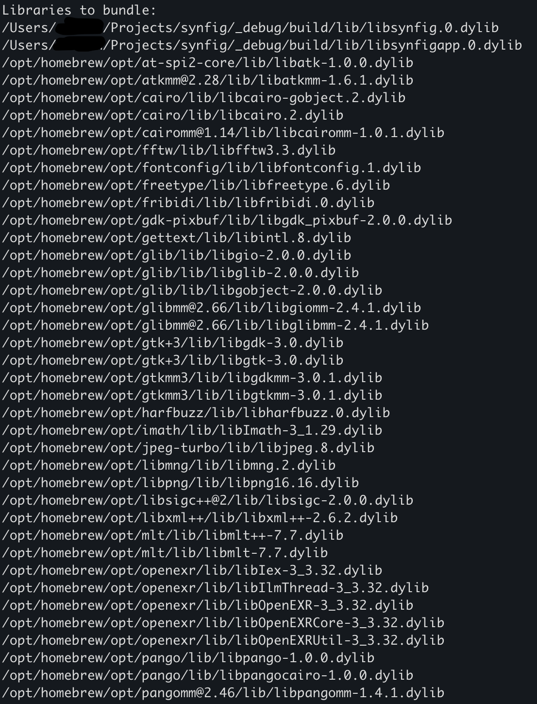

# Synfig-macOS-app-bundle-project

## Overview:
A repository to showcase my work on the project idea: MacOS app bundle of Synfig for Google Summer of Code 2025

## Phases
The projects will be completed in parts starting with (but not limited to) the following implementations:
- add script/program to collect executable/library dependencies (python/c++ preferred) to SynfigStudio.app folder

- add support for signing binary files (this should be done in reverse order, files without dependencies should be signed first, SynfigStudio.app should be signed last)

- remove the macOS launcher script, add the code to set up the required macOS environment from the synfig/synfigstudio apps

- add cpack support to build installer on macOS

- add python and lxml packaging to .app (with signing)

- interface/menu improvements for more native macOS support
## Prerequisite
Synfig installation from source (Github:https://github.com/synfig/synfig ) <br>
Also check: https://synfig-docs-dev.readthedocs.io/en/latest/building/Building%20Synfig.html

## Installation
```sh
# Clone the repository
git clone https://github.com/Stargazer10101/Synfig-macOS-app-bundle-project.git

# Change directory
cd Synfig-macOS-app-bundle-project
```

## Usage
```sh

# For dependencies_script_2
python3 dependencies_script_2.py /path/to/synfig.git 
```
If you used **homebrew** during the installation process, you may observe the script return dependencies as follows:


## Contributing
Contributions are welcome! Please open an issue or submit a pull request.