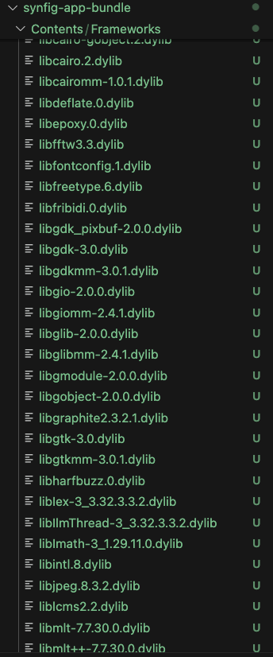

# Synfig-macOS-app-bundle-project

## Status:
✅ Dependencies Collection Script (dependency_collection_4.py)  
✅ Signing Script (code_signing_1.py)  
✅ Setup macOS environment from synfig/synfigstudio apps (CMakeLists.txt)  
🔄 Cpack support to build installer on macOS  
🔄 Python and lxml packaging to .app(with signing)  
🔄 Interface/menu improvements for more native macOS support  

## Overview:
A repository to showcase my work on the project idea: MacOS app bundle of Synfig for Google Summer of Code 2025

## Phases
The projects will be completed in parts starting with (but not limited to) the following implementations:
- add script/program to collect executable/library dependencies (python/c++ preferred) to SynfigStudio.app folder

- add support for signing binary files (this should be done in reverse order, files without dependencies should be signed first, SynfigStudio.app should be signed last)

- remove the macOS launcher script, add the code to set up the required macOS environment from the synfig/synfigstudio apps

- add cpack support to build installer on macOS

- add python and lxml packaging to .app (with signing)

- interface/menu improvements for more native macOS support
## Prerequisite

SynfigStudio installation (SynfigStudio.app required)


## Installation
```sh
# Clone the repository
git clone https://github.com/Stargazer10101/Synfig-macOS-app-bundle-project.git

# Change directory
cd Synfig-macOS-app-bundle-project
```

## Usage - dependencies_collection_2.py 
```sh

# For dependencies_collection_2.py
python3 dependencies_collection_2.py /path/to/SynfigStudio.app 
```

If you used **homebrew** during the installation process, you may observe the script return dependencies as follows:


## Usage - dependencies_collection_3.py 
```sh

# For dependency_collection_3.py (Caution: this will modify the app bundle)
python3 dependencies_collection_3.py --app /path/to/SynfigStudio.app 
```
The script may run for several minutes and the dependencies will be copied to /Contents/Frameworks/ of the app.




## Contributing
Contributions are welcome! Please open an issue or submit a pull request.